# Лабораторная работа №6

<h2 align="center"> Цели лабораторной работы</h2>
Изучение базовых возможностей системы
управления версиями, опыт работы с Git Api, опыт работы с локальным и
удаленным репозиторием.

<h2 align="center"> Основная часть</h2>

### 1. Регистрация и настройка  Git
Аккаунт на Github и Git уже был создан и установлен соответственно, поэтому в рамках лабораторной работы это не выполнялось вновь.

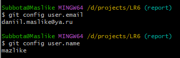
<h4 align="center">Рисунок 1 - Данные регистрации из Git</h4>

### 2. Сделать копию в личное хранилище из https://github.com/Kurtyanik/LR6/ (Fork)

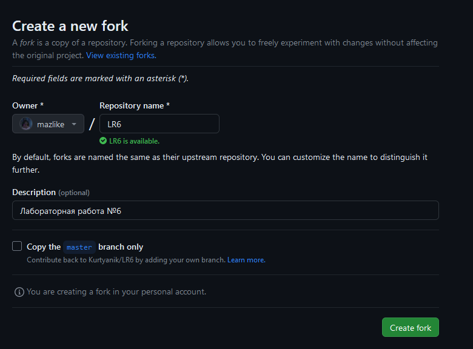
<h4 align="center">Рисунок 2 - Создание форка</h4>

### 3. Клонировать свой личный удалённый репозиторий на компьютер

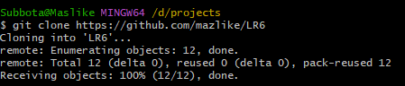
<h4 align="center">Рисунок 3 - Копирование репозитория</h4>

### 4. Добавить файл через интерфейс GitHub. Подтянуть изменения в локальный репозиторий.

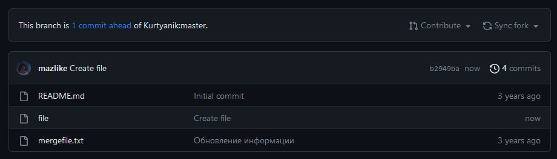
<h4 align="center">Рисунок 4 - Создание файла в гитхабе</h4>

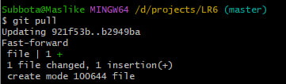
<h4 align="center">Рисунок 5 - Получение изменений</h4>

### 5. Получить историю операций для каждой из веток.

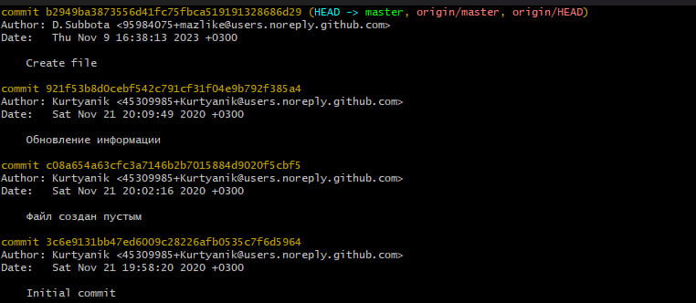
<h4 align="center">Рисунок 6 - История master ветки</h4>

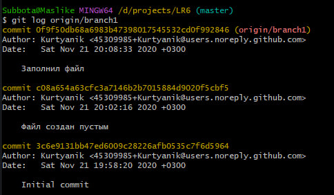
<h4 align="center">Рисунок 7 - История branch1 ветки</h4>

### 6. Просмотреть последние изменения.

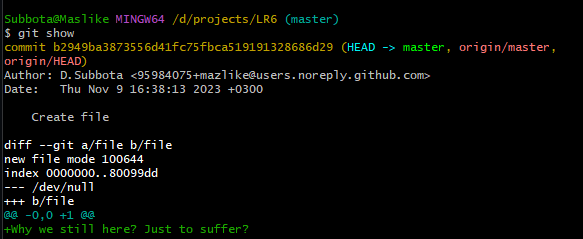
<h4 align="center">Рисунок 8 - Последнее изменение в ветке master</h4>

### 7. Разрешение конфликта, слияние веток, удаление побочной ветки.

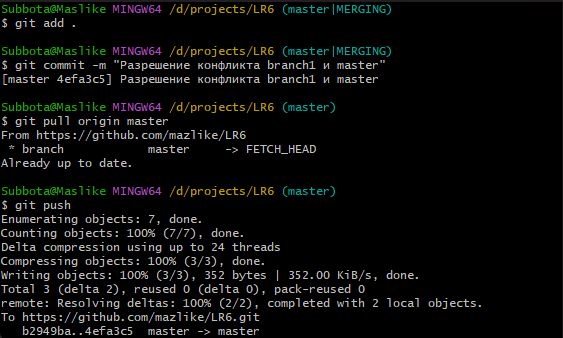
<h4 align="center">Рисунок 9 - Разрешение конфликта и слияние веток</h4>

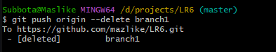
<h4 align="center">Рисунок 10 - Удаление побочной ветки</h4>

### 7. Фиксация последующих разных изменений и откат ненужного коммита.

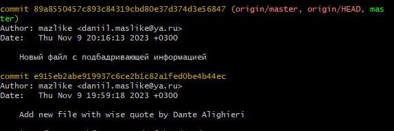
<h4 align="center">Рисунок 11 - Фиксация изменений</h4>

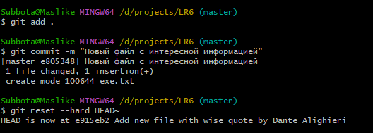
<h4 align="center">Рисунок 12 - Откат фиксации изменений</h4>

### 8. Создание ветки отчёта.

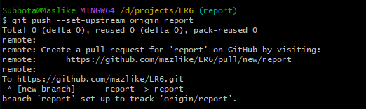
<h4 align="center">Рисунок 13 - Создание ветки отчёта</h4>

### 9. Начать оформлять отчёт в файле README.md. При написании отчёта периодически делать коммиты, не забывать комментировать.

<h4 align="center">Рисунок 14 - Написание отчёта</h4>

### 10. Получить историю операций в форматированном виде (сокращённый хэш + дата + имя автора + комментарий). Добавить её в отчёт и сделать финальную фиксацию изменений

<h4 align="center">Рисунок 15 - История операций</h4>

<h2 align="center"> Вывод </h2>
В ходе выполнения лабораторной работы:

1. Изучен интерфейс GitHub
2. Использованы команды гит, такие как:
   - git config --list --show-origin - Просмотр глобальных настроек Git на компьютере 
   - git clone - Клонирование удалённого репозитория 
   - git pull origin master - Применение изменений  
   - git log и git log origin/branch1 - Посмотреть историю определённых веток 
   - git show - Посмотреть изменения 
   - git add - Добавить файл в список отслеживаемых гитом  
   - git commit - Создание коммита  
   - git push origin --delete branch1 - Удаление ветки  
   - git reset --hard HEAD~ - Откат коммита на один назад
   - git checkout report - Создание ветки  
   - git log --pretty=format:"%h - %ad | %an | %s" - Форматированный вывод истории  
